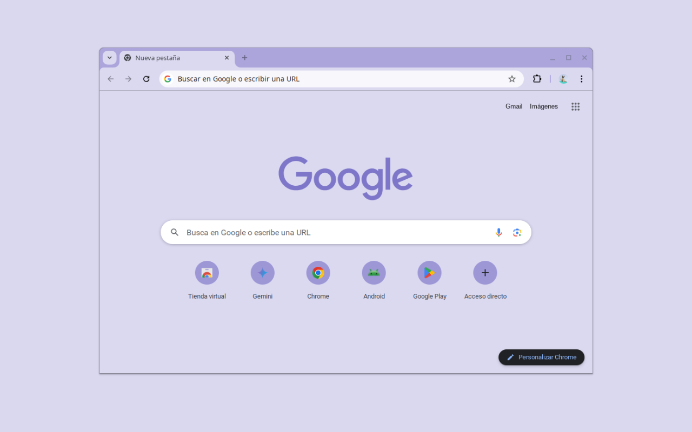

# Minimalist Grape Juice

A minimal Chrome theme in a calm, grape-purple palette, by Miguel Euraque.

The frame and buttons sit in a soft lavender, the toolbar and new tab page fade into a paler lilac, and the text stays a neutral gray. It sticks to one grape-purple family, so it feels quiet and consistent from the tab bar to the new tab page.

## Features

- **Palette:** muted lavender frame, pale lilac surfaces, neutral gray text
- **Minimalist design:** clean and uncluttered
- **Easy installation:** Chrome Manifest V3
- **Gentle on the eyes:** low-contrast colors that stay easy to read

## Installation

### Chrome Web Store (recommended)

1. Visit the [Minimalist Grape Juice](https://chromewebstore.google.com/detail/minimalist-grape-juice/ojbhoikombpgbehffhbepfkkfgafpmka) page in the Chrome Web Store.
2. Click **Add to Chrome**.

### From source

1. Clone this repository.
2. Open `chrome://extensions` and turn on Developer mode.
3. Click **Load unpacked** and select the theme folder.
